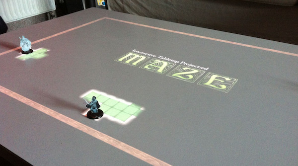
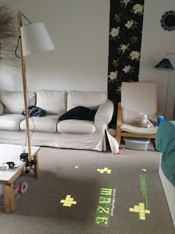

Interactive Tabletop Project:ed
===============================

Interactive Tabletop Project:ed is a framework for creating interactive, digital tabletop projects, focusing mainly on board games played with physical bricks. It provides a JavaScript client API for easy content creation.

A working prototype setup consisting of a portable projector and a Raspberry Pi with attached camera module can be seen below.

Features
========

* Easy setup and content creation with plain HTML and JavaScript.
* Detecting bricks on a tiled board.
* Detecting simple shapes. Simply feed the algorithm with an image of the shape and start using the detector.
* Detecting images. Simply feed the algorithm with an image and start using the detector. (WIP!)

Getting up and running
======================

_This project is WIP and is based on the older project of the same name. Therefore don't expect this documentation to be up-to-date._

The computer vision backend is written in Python/OpenCV and communicates with the webpage through WebSockets.

Given you have Python and OpenCV installed, getting up and running is as simple as starting the backend server:

    $ cd Server/src
    $ python main.py

and referencing the client library in a web page and initializing it as follows (CoffeeScript source):

    @client = new Client()
    @client.connect((() => @onConnected()), ((json) => @onMessage(json)))
    
    onConnected: ->
        @client.reset()
    
    onMessage: (json) ->
        switch json["action"]
            ...

To create a tiled board of size (32, 20) and wait for a brick to be found in any of the top/left corner tiles implement the following few lines:

    onMessage: (json) ->
        switch json["action"]
            when "reset" then @client.initializeBoard()
            when "initializeBoard" then @client.initializeTiledBoardArea(tileCountX=32, tileCountY=20, x1=0.0, y1=0.0, x2=1.0, y2=1.0, areaId=0)
            when "initializeTiledBoardArea" then @client.reportBackWhenBrickFoundAtAnyOfPositions(areaId=0, validPositions=([0, 0], [1, 0], [1, 0]))
            when "brickFoundAtPosition" then alert("Brick found at position: " + json["payload"]["position"])

See Content/MAZE for a complete reference implementation of a simple MAZE game.

Photos
======

